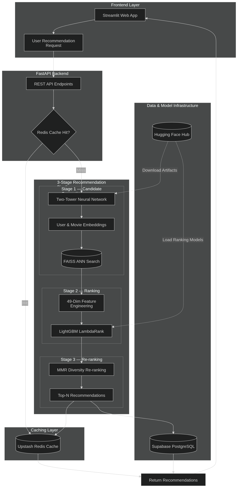

# MovieRec: Production-Grade Recommender System

A full-stack, production-ready machine learning recommendation system built to serve personalized movie suggestions. It leverages a **3-stage ranking funnel** (Candidate Generation → Ranking → Re-ranking) typically used by enterprise systems like YouTube and Netflix, prioritizing high relevance, diversity, and sub-100ms latency.

---

## What is this?
This project is an end-to-end Machine Learning pipeline and web application trained on the **MovieLens 1M** dataset. It is not just a notebook—it features an asynchronous **FastAPI backend**, a **Streamlit frontend**, and integrates with managed cloud services to handle data storage, model registry, and high-speed caching.

### Key Features
- **Two-Tower Neural Network**: PyTorch-based model for generating 64-dimensional user and item embeddings.
- **Approximate Nearest Neighbors (ANN)**: Ultra-fast candidate generation over 3,700+ movies using **FAISS**.
- **LightGBM Ranker**: State-of-the-art tree-boosting algorithm (LambdaRank) evaluating 49 dynamic features per user-item pair.
- **MMR Diversity Re-ranking**: Ensures recommendations don't fall into a "filter bubble" by maximizing genre diversity.
- **Serverless Redis Caching**: Sub-100ms API latency via Upstash.
- **Hugging Face Model Registry**: Automated artifact downloading directly from the HF Hub.

---

## System Architecture



### Core Components

1. **Frontend (Streamlit)**: A lightweight, interactive web application that provides the user interface for browsing movies, adjusting preferences (like diversity and top-N), and receiving real-time personalized recommendations.
2. **API Layer (FastAPI)**: A high-performance asynchronous backend that manages the routing, coordinates the ML funnel, and communicates with the database and cache.
3. **Caching (Upstash Redis)**: A serverless Redis instance used to cache API responses and item-item similarity vectors. It reduces latency for repeated queries to under 100ms.
4. **Candidate Generation (Two-Tower & FAISS)**: The first stage of the ML pipeline. It uses PyTorch-based embeddings to quickly narrow down the entire catalog of movies to the top 200 candidates via an Approximate Nearest Neighbor (ANN) search.
5. **Scoring & Ranking (LightGBM)**: The second stage of the pipeline. A highly optimized LambdaRank boosting model that computes a precise relevancy score for each of the top 200 candidates using 49 dynamic features.
6. **Diversity Re-ranking (MMR)**: The final stage of the pipeline. It applies Maximal Marginal Relevance to ensure the final top-10 list is not only highly relevant but also diverse across genres to avoid the "filter bubble."
7. **Database (Supabase PostgreSQL)**: Stores the core metadata, including user profiles, movie information, and historical interactions (ratings and feedback).
8. **Model Registry (Hugging Face Hub)**: Acts as the central repository for the trained machine learning models. The API downloads the latest models (`two_tower.pt`, `lgbm_ranker.txt`, etc.) directly from the Hub on startup.

---

## Technical Stack

| Category | Technologies |
|---|---|
| **Machine Learning** | PyTorch, LightGBM, FAISS, Scikit-Learn |
| **Backend & API** | Python 3.11, FastAPI, Uvicorn, Pydantic |
| **Database & ORM** | PostgreSQL (Supabase), SQLAlchemy, asyncpg |
| **Caching** | Redis (Upstash) |
| **Model Registry** | Hugging Face Hub |
| **Frontend** | Streamlit |
| **Deployment** | Docker, Render *(Ready)* |

---

## Performance & Stats
- **Data Scale**: Handled 1,000,209 interactions, 6,040 users, and 3,706 movies.
- **Latency Optimization**: 
  - *Cache Miss*: ~1.04 seconds (Running the full 3-stage funnel).
  - *Cache Hit*: **< 99 milliseconds** (via Upstash Redis).
- **Ranking Accuracy**: LightGBM achieves an **NDCG@10 approaching ~0.99** on offline holdout validation sets.
- **Scalability**: Batched database seeding (`execute_values`) efficiently upserted 1M rows into Supabase in under a minute.

---

## Project Structure

```text
recommendation-system/
├── api/                     # FastAPI backend
│   ├── routers/             # Endpoint definitions (recommend, similar, feedback)
│   ├── cache.py             # Upstash Redis integration
│   ├── database.py          # SQLAlchemy async & sync setup
│   ├── model_registry.py    # HF Hub downloader & memory loader
│   └── main.py              # Application entrypoint
├── features/                # Feature engineering modules
│   └── feature_store.py     # 49-dim vector builder & metadata store
├── frontend/                # Streamlit UI
│   └── app.py               # Main dashboard
├── models/                  # ML architectures
│   ├── two_tower.py         # PyTorch User & Item Embeddings
│   └── ranker.py            # LightGBM LambdaRank integration
├── pipeline/                # The 3-stage ML funnel
│   ├── candidate_generator.py 
│   ├── ranker_pipeline.py
│   └── reranker.py          # MMR logic
├── retrieval/               # Vector search
│   └── faiss_index.py       # FAISS indexing
├── scripts/                 # ETL and utility scripts
│   ├── load_data.py         # DB migration
│   ├── precompute_features.py 
│   └── upload_artifacts.py  # Hugging Face deployment
├── training/                # Training loops & dataset definitions
└── requirements.txt         # Pinned Python dependencies
```

---

## How to Use It

### 1. Installation
Clone the repository and install the dependencies:
```bash
git clone https://github.com/yourusername/recommendation-system.git
cd recommendation-system
python3 -m venv .venv
source .venv/bin/activate
pip install -r requirements.txt
```

### 2. Environment Setup
Create a `.env` file based on `.env.example` and add your cloud credentials for Supabase, Upstash, and Hugging Face.

### 3. Start the Backend (FastAPI)
The server will automatically download the required ML artifacts from Hugging Face on startup.
```bash
uvicorn api.main:app --host 0.0.0.0 --port 8000
```
- **Health Check**: `http://localhost:8000/health`
- **Swagger Docs**: `http://localhost:8000/docs`

### 4. Start the Frontend (Streamlit)
In a new terminal window:
```bash
streamlit run frontend/app.py
```
Open `http://localhost:8501` to view your personalized movie recommendations!

---

*Designed and developed to showcase modern, highly-scalable Machine Learning Engineering practices.*
