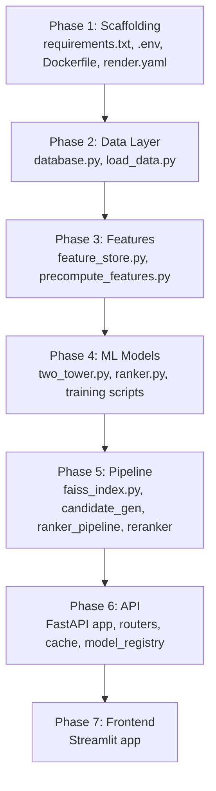

# 🎬 Production-Grade Recommender System — Implementation Plan

> **Spec Reference:** [recommender_system_spec.md](file:///home/avyakt/Work/recommendation-system/docs/recommender_system_spec.md)
>
> This plan follows the spec **exactly** — every file, class, function, and config referenced in the spec will be built as a real, working implementation.

---

## User Review Required

> [!IMPORTANT]
> **External accounts & API keys needed before execution can begin:**
>
> | Service | What's needed | Free tier |
> |---|---|---|
> | **Supabase** | `DATABASE_URL` — Create a project at [supabase.com](https://supabase.com) | 500MB PostgreSQL, free forever |
> | **Upstash Redis** | `UPSTASH_REDIS_URL` + `UPSTASH_REDIS_TOKEN` — Create at [upstash.com](https://upstash.com) | 10K req/day, 256MB |
> | **Hugging Face Hub** | `HF_TOKEN` + create a private repo `HF_REPO_ID` — [huggingface.co](https://huggingface.co) | Free for models < 10GB |
> | **Render** | Account at [render.com](https://render.com) for deployment | 750 hrs/month free |
> | **Streamlit Cloud** | Account at [streamlit.io/cloud](https://streamlit.io/cloud) for frontend deployment | Free |
>
> Please provide the credentials (or confirm you'll set them up) so I can create the `.env` file.

> [!WARNING]
> **Training the Two-Tower and LightGBM models** will run on CPU and may take 15-45 minutes depending on your machine. The spec targets CPU-only inference (no GPU required).

---

## Open Questions

1. **Do you want me to create actual Supabase/Upstash accounts**, or will you provide the credentials? I need at minimum `DATABASE_URL`, `UPSTASH_REDIS_URL`, and `UPSTASH_REDIS_TOKEN` before testing the data loading and API.

2. **For local development**, should I use a local PostgreSQL + local Redis instead of Supabase/Upstash initially, or do you want to go straight to the cloud free-tier services?

3. **Hugging Face repo**: Do you already have a HF account? I'll need `HF_TOKEN` and a repo name to push model artifacts to.

---

## Proposed Changes

The implementation is divided into **7 phases**, ordered by dependency. Each phase lists every file to create/modify.

---

### Phase 1: Project Scaffolding & Configuration

Set up the directory structure, dependencies, environment configuration, and Docker/deployment files.

#### [NEW] [requirements.txt](file:///home/avyakt/Work/recommendation-system/requirements.txt)
- Exact dependencies from spec: FastAPI, uvicorn, pydantic, SQLAlchemy, asyncpg, psycopg2-binary, torch, lightgbm, faiss-cpu, scikit-learn, pandas, numpy, upstash-redis, huggingface-hub, httpx, streamlit, python-dotenv, loguru
- Pinned versions as specified

#### [NEW] [.env.example](file:///home/avyakt/Work/recommendation-system/.env.example)
- Template with all env vars: `DATABASE_URL`, `UPSTASH_REDIS_URL`, `UPSTASH_REDIS_TOKEN`, `HF_TOKEN`, `HF_REPO_ID`, `API_PORT`, `ENV`, `LOG_LEVEL`, `TOP_N_DEFAULT`, `FAISS_TOP_K`, `RANKER_TOP_K`, `MMR_LAMBDA`, `CACHE_TTL_RECS`

#### [NEW] [.gitignore](file:///home/avyakt/Work/recommendation-system/.gitignore)
- Ignore: `data/raw/`, `artifacts/`, `.env`, `__pycache__/`, `*.pyc`, `.venv/`

#### [NEW] [Dockerfile](file:///home/avyakt/Work/recommendation-system/Dockerfile)
- Python 3.11-slim base, pip install, copy source, run `download_artifacts.py`, expose 8000, CMD uvicorn

#### [NEW] [render.yaml](file:///home/avyakt/Work/recommendation-system/render.yaml)
- Web service config: Docker runtime, free plan, env vars, health check path

#### [NEW] [README.md](file:///home/avyakt/Work/recommendation-system/README.md)
- Project overview, architecture diagram, setup instructions, usage examples

#### Directories to create
```
data/raw/
artifacts/
scripts/
models/
training/
retrieval/
features/
pipeline/
api/routers/
frontend/
notebooks/
```

---

### Phase 2: Data Layer

Download MovieLens 1M, parse it, define the PostgreSQL schema, and bulk-load into Supabase.

#### [NEW] [api/database.py](file:///home/avyakt/Work/recommendation-system/api/database.py)
- SQLAlchemy async engine + session factory
- Uses `DATABASE_URL` from environment
- Connection pool configuration

#### [NEW] [scripts/load_data.py](file:///home/avyakt/Work/recommendation-system/scripts/load_data.py)
Per spec section 4.2:
1. Download `ml-1m.zip` from GroupLens URL
2. Parse `users.dat`, `movies.dat`, `ratings.dat` (`::`-separated)
3. Extract year from title via regex `\((\d{4})\)$`
4. Split genres `"Action|Comedy"` → PostgreSQL TEXT array
5. Compute `avg_rating` and `rating_count` per movie
6. Bulk-insert via `psycopg2.extras.execute_values`
7. Log row counts
8. Creates all tables (`users`, `movies`, `ratings`, `feedback_events`) with exact schema from spec section 4.1 including all indexes

---

### Phase 3: Feature Engineering

Build all precomputed features and serialize them.

#### [NEW] [features/feature_store.py](file:///home/avyakt/Work/recommendation-system/features/feature_store.py)
Per spec section 8:
- `FeatureStore` class
- Precomputed features (loaded at startup):
  - `user_genre_pref_vec` (float[18]), `user_avg_rating`, `user_rating_count`
  - `item_genre_vec` (float[18]), `item_year_norm`, `item_avg_rating`, `item_rating_count_log`, `item_popularity_pct`
- On-the-fly features (computed per request):
  - `genre_overlap`, `two_tower_score`, `user_has_rated_genre`
- Methods: `get_user_features()`, `get_item_features()`, `build_rank_features()`
- Load/save as `features.pkl`

#### [NEW] [scripts/precompute_features.py](file:///home/avyakt/Work/recommendation-system/scripts/precompute_features.py)
- Reads from PostgreSQL, computes all precomputed features from spec section 8.1
- Saves `artifacts/features.pkl`

---

### Phase 4: ML Models & Training

Build the Two-Tower model, LightGBM ranker, training loops, and evaluation.

#### [NEW] [models/two_tower.py](file:///home/avyakt/Work/recommendation-system/models/two_tower.py)
Per spec section 5.3 — exact architecture:
- `UserTower`: user_id emb(64) + age emb(16) + gender emb(4) + occupation emb(16) + genre proj(18→18) → concat(118) → MLP(118→256→128→64) with BatchNorm, ReLU, Dropout(0.2) → L2 normalize
- `ItemTower`: item_id emb(64) + genre proj(18→32) + year proj(1→8) + avg_rating(1) + log_count(1) → concat(106) → MLP(106→256→128→64) with BatchNorm, ReLU, Dropout(0.2) → L2 normalize
- `TwoTowerModel`: combines both towers, dot product scoring

#### [NEW] [models/ranker.py](file:///home/avyakt/Work/recommendation-system/models/ranker.py)
Per spec section 6.2:
- LightGBM config dict with `lambdarank` objective
- `LGBM_PARAMS` as specified
- Helper functions for training and prediction

#### [NEW] [training/dataset.py](file:///home/avyakt/Work/recommendation-system/training/dataset.py)
Per spec section 5.4:
- `MovieLensDataset` — triplet sampling
- Each sample: `(user_features, positive_item_features, negative_item_features)`
- 4 negatives per positive (uniform from unrated movies)

#### [NEW] [training/train_two_tower.py](file:///home/avyakt/Work/recommendation-system/training/train_two_tower.py)
Per spec section 5.5:
- BPR loss: `-log(sigmoid(pos_scores - neg_scores)).mean()`
- Config: batch=2048, lr=1e-3, weight_decay=1e-5, epochs=30, AdamW, CosineAnnealingLR
- Time-based val split (last 10% of timestamps)
- Early stopping on val Recall@20, patience=5
- Save to `artifacts/two_tower.pt`

#### [NEW] [training/train_ranker.py](file:///home/avyakt/Work/recommendation-system/training/train_ranker.py)
Per spec section 6.4:
- Load positive ratings (≥4.0) as label=1
- Sample 10 negatives per user as label=0
- Compute full 45-feature vector per row
- Time-based split
- `lgb.Dataset` with `group` parameter for lambdarank
- Save to `artifacts/lgbm_ranker.txt`

#### [NEW] [scripts/precompute_embeddings.py](file:///home/avyakt/Work/recommendation-system/scripts/precompute_embeddings.py)
- Load trained Two-Tower model
- Run item tower over all 3,706 movies
- Save L2-normalized embeddings to `artifacts/item_embeddings.npy`

---

### Phase 5: Retrieval & Pipeline

Build the 3-stage inference pipeline.

#### [NEW] [retrieval/faiss_index.py](file:///home/avyakt/Work/recommendation-system/retrieval/faiss_index.py)
Per spec section 5.6:
- `FAISSItemIndex` class
- `IndexFlatIP` (inner product = cosine for L2-normalized vectors)
- `build()`: add item embeddings + IDs
- `search()`: return top_k item_ids

#### [NEW] [pipeline/candidate_generator.py](file:///home/avyakt/Work/recommendation-system/pipeline/candidate_generator.py)
Stage 1 wrapper:
- Takes user features → user tower → 64-dim embedding → FAISS search → top-200 candidate IDs

#### [NEW] [pipeline/ranker_pipeline.py](file:///home/avyakt/Work/recommendation-system/pipeline/ranker_pipeline.py)
Stage 2 wrapper:
- Takes user_id + 200 candidate IDs → build rank features → LightGBM predict → top-20 by score

#### [NEW] [pipeline/reranker.py](file:///home/avyakt/Work/recommendation-system/pipeline/reranker.py)
Per spec section 7:
- Already-watched filter (query ratings table)
- MMR re-ranking with `lambda_mmr=0.7`
- Returns final top-10 with full metadata

---

### Phase 6: API Layer

Build the FastAPI backend with all endpoints, caching, and model registry.

#### [NEW] [api/main.py](file:///home/avyakt/Work/recommendation-system/api/main.py)
Per spec section 9.1:
- FastAPI app with `lifespan` context manager
- Load all models via `ModelRegistry` at startup
- Include routers with `/api/v1` prefix

#### [NEW] [api/model_registry.py](file:///home/avyakt/Work/recommendation-system/api/model_registry.py)
Per spec section 9.2:
- `ModelRegistry` class holding: `two_tower`, `ranker`, `faiss_index`, `features`, `item_meta`
- `load_all()`: loads from `./artifacts/`, downloads from HF Hub if missing

#### [NEW] [api/cache.py](file:///home/avyakt/Work/recommendation-system/api/cache.py)
Per spec section 10:
- Upstash Redis client
- Cache key patterns: `rec:{user_id}:{top_n}`, `sim:{movie_id}:{top_n}`, `user_feats:{user_id}`, `item_meta:{movie_id}`
- TTLs: 1h for recs, 24h for similar, 12h for user feats, 24h for item meta
- Invalidation on feedback events

#### [NEW] [api/routers/recommend.py](file:///home/avyakt/Work/recommendation-system/api/routers/recommend.py)
Per spec section 9.3:
- `GET /api/v1/recommend/{user_id}` with params: `top_n`, `exclude_watched`, `diversity`
- Full 3-stage pipeline call (cache → user tower → FAISS → LightGBM → MMR)
- Response shape as specified

#### [NEW] [api/routers/similar.py](file:///home/avyakt/Work/recommendation-system/api/routers/similar.py)
- `GET /api/v1/similar/{movie_id}` with param: `top_n`
- Item-to-item cosine similarity via FAISS

#### [NEW] [api/routers/feedback.py](file:///home/avyakt/Work/recommendation-system/api/routers/feedback.py)
- `POST /api/v1/feedback`
- Insert into `feedback_events` table
- Invalidate Redis cache for user

#### [NEW] [api/routers/health.py](file:///home/avyakt/Work/recommendation-system/api/routers/health.py)
- `GET /health`
- Returns `{"status": "ok", "models_loaded": true, "faiss_index_size": 3706}`

#### [NEW] [api/routers/__init__.py](file:///home/avyakt/Work/recommendation-system/api/routers/__init__.py)

#### [NEW] [scripts/download_artifacts.py](file:///home/avyakt/Work/recommendation-system/scripts/download_artifacts.py)
Per spec section 15.3:
- Downloads `two_tower.pt`, `lgbm_ranker.txt`, `item_embeddings.npy`, `features.pkl` from HF Hub

---

### Phase 7: Frontend (Streamlit)

#### [NEW] [frontend/app.py](file:///home/avyakt/Work/recommendation-system/frontend/app.py)
Per spec section 11:
- **Page 1: User Recommendations** — user_id input, top_n slider, diversity slider, movie card grid with poster, title, genres, score badge, cache indicator, latency display
- **Page 2: Movie Explorer** — search box, similar movies grid
- **Page 3: System Stats** — health endpoint data, model metadata, FAISS index size
- API client using `httpx` with `@st.cache_data(ttl=3600)`

---

## Verification Plan

### Automated Tests

1. **Data loading**: Run `scripts/load_data.py`, verify row counts match spec (6,040 users, 3,706 movies, 1,000,209 ratings)
2. **Feature computation**: Run `scripts/precompute_features.py`, verify `features.pkl` contains correct keys and shapes
3. **Two-Tower training**: Run `training/train_two_tower.py`, verify model saves and achieves val Recall@20 improvement over epochs
4. **Ranker training**: Run `training/train_ranker.py`, verify NDCG@10 targets
5. **API endpoints**: Start server, test all 4 endpoints with `httpx`:
   - `GET /health` → 200 OK
   - `GET /api/v1/recommend/42` → 200 OK with 10 results
   - `GET /api/v1/similar/1196` → 200 OK
   - `POST /api/v1/feedback` → 200 OK
6. **Latency**: Verify P99 < 200ms for `/recommend` endpoint
7. **End-to-end pipeline**: Offline evaluation targeting Recall@10 ≥ 0.25, NDCG@10 ≥ 0.30

### Manual Verification

- Visually verify Streamlit UI renders correctly with all 3 pages
- Check that recommendations make intuitive sense (e.g., Star Wars fan gets sci-fi/action suggestions)
- Verify cache hit/miss indicator works

---

## Execution Order Summary



**Total files to create: ~30 files** (excluding notebooks which are optional for now).
